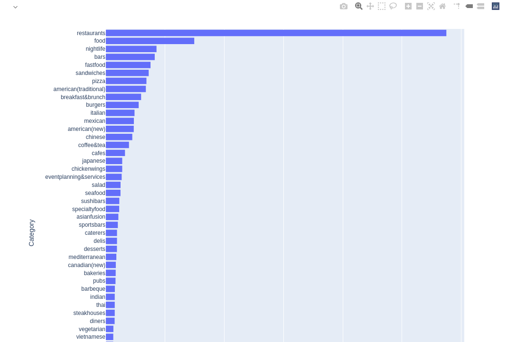

# Constrained Food Recommender Problem Set

This repository contains a set of problems for Recommender Systems and Constraint Satisfaction problems.

To see the text instructions of the task see notion [note](https://www.notion.so/Food-Recommender-with-Constraints-73d5f7dbf4dd4d57b1963399e5809ee6)

## Steps to open notebook with interactive visualizations (in other case plots will not be displayed at all)

* Run in terminal:
`jupyter notebook --NotebookApp.iopub_data_rate_limit=214748364`
* Make notebook trusted

## Data Visualizations

Just in case dynamic plots did not appear in your browser notebook, I place plot screenshots here

### Plot cities sorted by number of restaurants

### Number of reviews per city

### Restaurant hours distribution

### Visualize restaurant locations on map

### Top frequent restaurant categories

### Top frequent restaurants attributes

